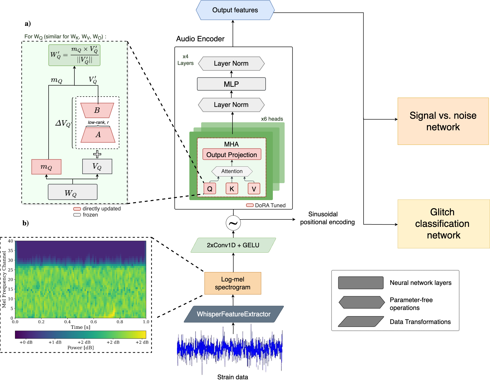

# GW-Whisper

> We introduce GW-Whisper, an innovative application of [OpenAI](https://openai.com/)’s [Whisper model](https://arxiv.org/abs/2212.04356), originally designed for speech recognition, to [gravitational wave (GW)](https://www.ligo.caltech.edu/page/what-are-gw) data analysis. As the volume of data from advanced detectors like [LIGO](https://en.wikipedia.org/wiki/LIGO) and [Virgo](https://www.virgo-gw.eu/) grows, traditional methods face scalability challenges. GW-Whisper leverages Whisper’s pre-trained architecture to address critical tasks in GW astronomy, including signal detection and glitch classification, by fine-tuning the model using the parameter-efficient [DoRA](https://arxiv.org/abs/2402.09353) method. This fine-tuning updates only 0.5% of the model’s parameters, significantly reducing computational costs.
The architecture of GW-Whisper is shown below:




## Overview
## An Introduction to Gravitational Waves and LIGO Data
The Laser Interferometer Gravitational-Wave Observatory (LIGO) is a revolutionary astrophysical observatory designed specifically to detect gravitational waves. These waves are ripples in spacetime caused by violent cosmic events such as the merger of black holes or neutron stars. LIGO's detections provide a novel way to study the universe, complementary to traditional electromagnetic observatories.

### How LIGO Works:
LIGO consists of two large-scale interferometers located in Hanford, Washington, and Livingston, Louisiana. Each interferometer has two arms, each 4 km long. A laser beam is split and sent down each arm, reflecting back from mirrors at the end. When a gravitational wave passes through, it stretches one arm and compresses the other, causing a tiny change in the length of the arms. This changes the path the light travels, leading to an interference pattern when the split beams are recombined. By measuring this interference, LIGO can detect the passage of a gravitational wave. This data, which is a frequency signal over time, is similar to audio data, which has been studied and used extensively in the AI/ML world.

## Components

| Repository | Status | Description | Paper link |
|------------|---------|-------------|-------------------|
| [Detection](https://github.com/chayanchatterjee/GW-Whisper/tree/main/Detection) | Public | Code repo for signal vs. noise classification | [link](https://arxiv.org/abs/2412.20789) |
| [Glitch classification](https://github.com/chayanchatterjee/GW-Whisper/tree/main/Glitch_classification)| Public | Code repo for glitch classification | [link](https://arxiv.org/abs/2412.20789) |

## Getting Started

Each repository contains its own detailed documentation and setup instructions. This repo contains introductory information to the project and working with graviational wave data. We recommend starting with

1. [Our wiki page](https://github.com/vanderbilt-data-science/LIGO/wiki) for understanding our core architecture and methodology.
2. [Our exploratory notebooks](link-to-repo) to begin working with graviational wave data.

## Project Structure

The codebase is structured as follows:

```
GW-Whisper/
├── Detection/
|   ├── Efficiency_test/
|   |   ├── src/
│   │   └── ...
│   ├── Real_events/
│   │   ├── evaluation_real_events.py
│   │   └── ...
|   ├── data/
│   ├── results/   
│   ├── src/
|   ├── preprocess.py  
│   ├── run_train.py
│   └── ...
├── Glitch_classification/
│   ├── src/
│   ├── results/
|   ├── train.py
│   └── generate_glitch_dataset.py
|   └── ...
└── requirements.txt
└── ...
```
## Team

This project is developed at Vanderbilt University as a joint effort between @vanderbilt-data-science and the Physics and Astronomy department. 
For inquiries, please contact the project leads.

#### Project Leads
Karan Jani, Ph.D. (PI) - Associate Professor of Physics and Astronomy. Email: karan.jani@vanderbilt.edu  
Chayan Chatterjee, Ph.D. (Co-PI) - DSI/Astronomy Postdoctoral Researcher. Email: chayan.chatterjee@vanderbilt.edu    
Abbie Petulante, Ph.D. DSI Postdoctoral Researcher. Email: abigail.petulante@vanderbilt.edu    
Jesse B Spencer-Smith, Ph.D. - Vanderbilt University DSI (DSI) Chief Data Scientist. Email: jesse.spencer-smith@vanderbilt.edu  

#### Contributors
Roy Lau - code contributor. Email: roy.lau@vanderbilt.edu 
Haowei Fu - code contributor. Email: haowei.fu@vanderbilt.edu 
Alara Kaymak - code contributor. Email: alara.kaymak@vanderbilt.edu 
Echo Yu - code contributor. Email: tianrun.yu@vanderbilt.edu    
Suyash Deshmukh - code contributor. Email: suyash.deshmukh@vanderbilt.edu      
Albert Hu - code contributor. Email: yang.hu.1@vanderbilt.edu   
Stephen Zhao - code contributor, project manager. Email: chong.zhao.1@vanderbilt.edu    
Divya Mereddy  - code contributor. Email: divya.mereddy@vanderbilt.edu       
Brandon Soubasis  - code contributor. Email: brandon.j.soubasis@vanderbilt.edu   
Ricky Sun - code contributor. Email: qifeng.sun@vanderbilt.edu  
Zack Braasch - project manager. Email: zack.braasch@vanderbilt.edu   
Youngbin Kwon - code contributor. Email: youngbin.kwon@vanderbilt.edu  
Ziyao Zhang - code contributor. Email: ziyao.zhang@vanderbilt.edu 

## License

## Publications
